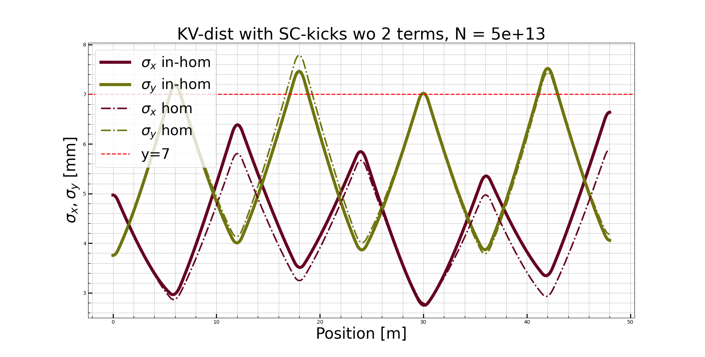
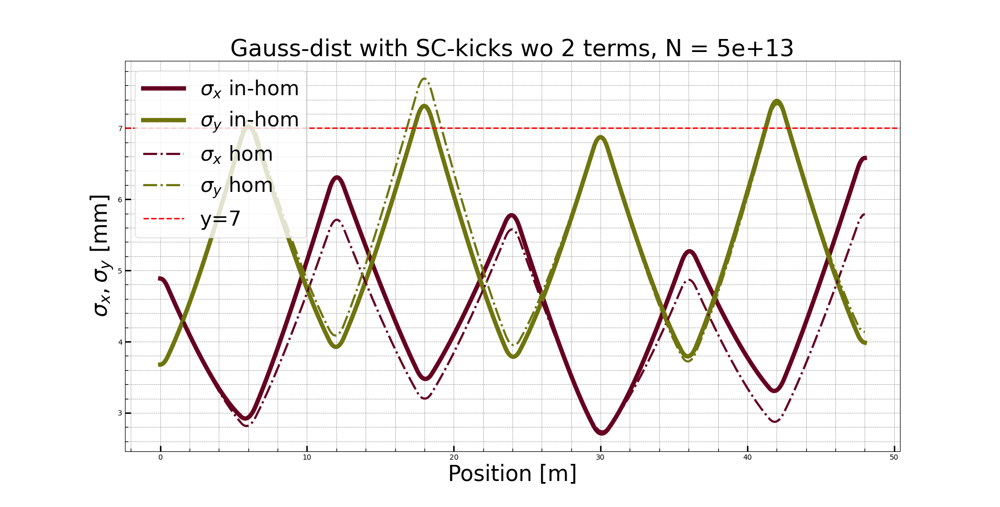

# GaussianSpaceCharge

This repository contains the implementation, with some bugs,  of an Analytic Space-Charge Model for Gaussian Beams with cross-plane coupling, based on the research paper by M. Holz and V. Ziemann ([link to the paper](https://uu.diva-portal.org/smash/get/diva2:1160961/FULLTEXT01.pdf)).

## Installation

To install the package, follow the instructions:

```bash
$ git clone https://github.com/isavoj/GaussianSpaceCharge.git
$ cd GaussianSpaceCharge
```

(Optional step, but recommended:) 
Create and activate a virtual environment:
```bash
$ python -m venv env
$ source env/bin/activate  # On Windows, use 'env\Scripts\activate'
```
Now, 
```bash
$ python setup.py install
```

## Run the main script:
```bash
$ cd GaussianSpaceCharge
$ (env) python main.py
```

 ----------------------------------------
## Project Overview

The project contains 1 module called `GaussianSpaceCharge`, within which you'll find 4 files:
- `main.py`
- `space_charge_calc.py`
- `elements.py`
- `beam.py`

All space charge (SC) calculations are handled within the `space_charge_calc.py` file,containing:  
- **`NonLinearSc` Class**
- **`calculate_T_components_linear` Function**
- **`calculate_matrix_T` Function**

All relevant Parameters are changed in `main()` in `main.py`

Except for : 
1. **Perveance**: Change beam parameters for perveance by modifying the `beam_perveance` function in `beam.py`.
2. **SC -T matrix**: Adjust the T matrix in `space_charge_calc.py`, there are 2 now, 1 uncommented that includes the **problematic `x4_f3` and `x2_f1 terms`**
   
## Overview 

When you run `main.py`, the `main()` function is invoked, 
which in turn calls the function `propagate_beam_through_lattice()`. 
This function iterates over each sliced element (divided by 2 to apply Space Charge (SC) more accurately) in a series of FODO cells and calculates the space charge effects for each slice.

```plaintext
+------------------------------------------------------+
|                        main()                        |
|  +-----------------------------------------------+   |
|  | Define lattice configuration and properties  |    |
|  | Set up Twiss parameters                      |    |
|  | Configure SD and cutoff for Gaussian dist.   |    |
|  | Calculate initial covariance matrix (sigma)  |    |
|  | * Propagate beam through lattice             |    |
|  | Plot resulting beam envelope                 |    |
|  +-----------------------------------------------+   |
+------------------------------------------------------+
                     |                                 | 
                     v                                 |
          +-----------------------------------+        |
          | * propagate_beam_through_lattice() |       |
          |   +---------------------------+    |       |
          |   | Iterate over elements     |    |       |
          |   |   + Calculate transport   |    |       |
          |   |   + **Apply space charge  |  |       |
          |   |   + Complete step         |    |       |
          |   +---------------------------+    |       |
          +-----------------------------------+        |
                     |                                 |
                     v                                 |
         +----------------------------+                |                                          
         | **space_charge_calc.calculate_matrix_T()    |
         +----------------------------+

```
----------------------------------------

## Issue: 
The  `x4_f3` and `x2_f1` terms in the T- matrix seem to cause problems for me. Why? 
Because when I run with homogenous space charge terms, hence space-charge matrix for KV-distrbution, I get something very similar

### PLOTS WITHOUT `x4_f3` and `x2_f1` terms  (with homogenous linear space-charge matrix and  non-homogenous linear space-charge terms)
#### KV distribution


#### Gaussian distribution



